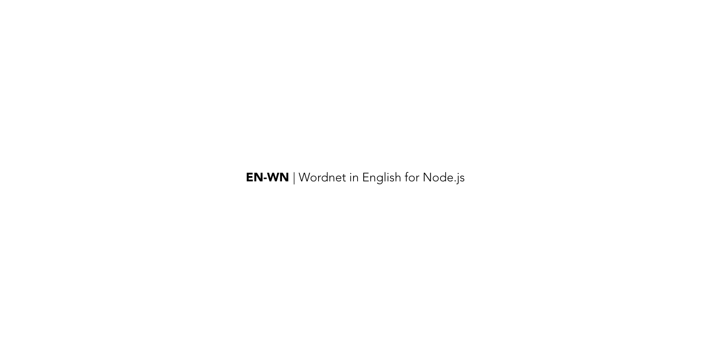

En-Wordnet is a node.js module which makes [Princeton University's Wordnet](https://wordnet.princeton.edu/) available as a package.

## About

WordNet® is a large lexical database of English. Nouns, verbs, adjectives and adverbs are grouped into sets of cognitive synonyms (synsets), each expressing a distinct concept. Synsets are interlinked by means of conceptual-semantic and lexical relations. The resulting network of meaningfully related words and concepts can be navigated with the browser. WordNet is also freely and publicly available for download. WordNet's structure makes it a useful tool for computational linguistics and natural language processing.

## Where did you find this?

The latest version of the Wordnet can be found at the [website](https://wordnet.princeton.edu/download/current-version). There are links to both the 3.0 version and the 3.1 version. We are using the `data` and `index` files from the 3.1 DB version.

## Is this credible?

WordNet is probably one of _the_ most credible sources of lexical data in english on the internet right now. If you would like to try it out for yourself, please [go here](http://wordnetweb.princeton.edu/perl/webwn).

## Are there things that are missing

Yes, there are other files which I have completely ignored so far. [Standoff Files](https://wordnet.princeton.edu/download/standoff-files) and [Old Versions](https://wordnet.princeton.edu/download/old-versions) have been completely skipped. I will not be adding them till I can find a use case for it, if you have one, please share.

## How do I actually use this data?

The Parser for wordnet DB files will be in a separate repository. I did this because there are other significant pieces of work which follow the specifications set up by Wordnet (like the [Open MultiLingual Wordnet](http://compling.hss.ntu.edu.sg/omw/index.html)) and the parser would be able to utilize all of those to provide multi-lingual support.

## How to I understand the data structures

The data structure is very clearly defined in these two documents
- [wndb](https://wordnet.princeton.edu/documentation/wndb5wn), which talks about index.* and data.* files
- [wninput](https://wordnet.princeton.edu/documentation/wninput5wn), which talks about the lexicographer file format and the word syntax

## This is released under which license?

The complete license for Wordnet can be found on [their website](https://wordnet.princeton.edu/license-and-commercial-use) and on [this repo](https://github.com/open-language/en-wordnet/blob/master/LICENSE)

## Credits

- [TJ Holowaychuk](https://github.com/tj) for showing us how to use black and white beautifully to create the image on the top of the readme. Inspiration from [apex/up](https://github.com/apex/up)
- [Princeton Univerysity's Wordnet](https://wordnet.princeton.edu/) for bringing so much sanity in the world